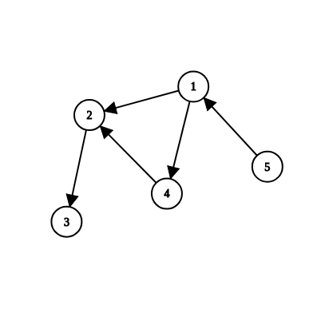
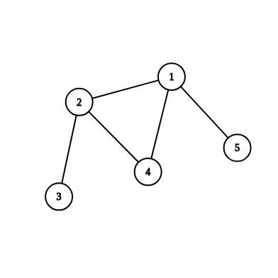
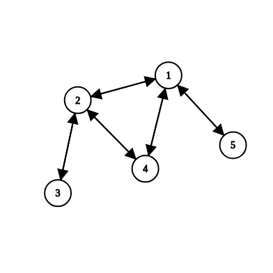

#Graphs
Graph is a data structure that consists of following two components:
1. A finite set of vertices also called as nodes.
2. A finite set of ordered pair of the form $(u, v)$ called as edge. The pair is ordered because $(u, v)$ is not same as $(v, u)$ in case of a directed graph(di-graph). The pair of the form $(u, v)$ indicates that there is an edge from vertex u to vertex v. The edges may contain weight/value/cost.

Now consider this graph 

This graphs gives an idea on how we can move from one node to another.

Explanation, when we are at node 1, we can go to node 2 and 4.
From node 2 to node 3
From node 3 to nowhere
From node 4 to node 2
and From node 5 to node 1.

**Directed vs Undirected Graph**

Consider the previous graph and this new one:

This is the same graph but it is not restriced by direction, than means that if we can go to 3 from 2, then we can also go back to 2 from 3, in other words any undirected graph such as above on can be equivalent to a directed graph like this

**Graph Representation:**

Graph are popularly represented by these two methods,
1. Adjacency Matrix
2. Adjacency List

Now 